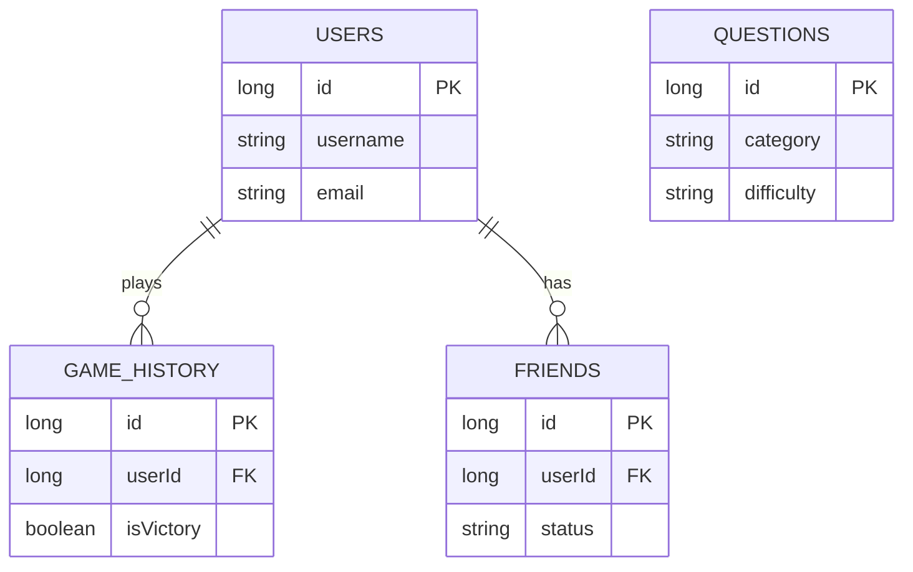

# Database Schema Documentation

This document describes the SQLite database schema for the QuizBattle application. The database is implemented using the Room Persistence Library.

## Database Info

- **Name:** `quiz_battle_database`
- **Version:** 1

---

## 1. Table: `users`

Stores local user account information.

| Column Name  | Type    | Constraints                | Description                |
| ------------ | ------- | -------------------------- | -------------------------- |
| `id`         | INTEGER | PRIMARY KEY, AUTOINCREMENT | Unique user ID             |
| `username`   | TEXT    | NOT NULL                   | User's display name        |
| `email`      | TEXT    | NOT NULL                   | User's email address       |
| `password`   | TEXT    | NOT NULL                   | Hashed password            |
| `points`     | INTEGER | DEFAULT 0                  | Total points accumulated   |
| `wins`       | INTEGER | DEFAULT 0                  | Total battles won          |
| `losses`     | INTEGER | DEFAULT 0                  | Total battles lost         |
| `totalGames` | INTEGER | DEFAULT 0                  | Total games played         |
| `createdAt`  | INTEGER | DEFAULT (current time)     | Account creation timestamp |
| `isLoggedIn` | INTEGER | DEFAULT 0 (false)          | Login session status       |

---

## 2. Table: `questions`

Stores quiz questions for offline battle mode.

| Column Name          | Type    | Constraints                | Description                         |
| -------------------- | ------- | -------------------------- | ----------------------------------- |
| `id`                 | INTEGER | PRIMARY KEY, AUTOINCREMENT | Unique question ID                  |
| `questionText`       | TEXT    | NOT NULL                   | The question content                |
| `answer1`            | TEXT    | NOT NULL                   | Option A                            |
| `answer2`            | TEXT    | NOT NULL                   | Option B                            |
| `answer3`            | TEXT    | NOT NULL                   | Option C                            |
| `answer4`            | TEXT    | NOT NULL                   | Option D                            |
| `correctAnswerIndex` | INTEGER | NOT NULL                   | Index of correct answer (0-3)       |
| `category`           | TEXT    | DEFAULT "General"          | Question category (e.g. Science)    |
| `difficulty`         | TEXT    | DEFAULT "Medium"           | Difficulty level (Easy/Medium/Hard) |
| `isActive`           | INTEGER | DEFAULT 1 (true)           | Soft delete flag                    |

---

## 3. Table: `game_history`

Stores history of completed battles.

| Column Name      | Type    | Constraints                | Description                    |
| ---------------- | ------- | -------------------------- | ------------------------------ |
| `id`             | INTEGER | PRIMARY KEY, AUTOINCREMENT | Unique match ID                |
| `userId`         | INTEGER | NOT NULL                   | ID of the user who played      |
| `opponentName`   | TEXT    | NOT NULL                   | Name of opponent (or "AI Bot") |
| `userScore`      | INTEGER | NOT NULL                   | User's final score/health      |
| `opponentScore`  | INTEGER | NOT NULL                   | Opponent's final score/health  |
| `isVictory`      | INTEGER | NOT NULL                   | Boolean (1 = Win, 0 = Loss)    |
| `totalQuestions` | INTEGER | NOT NULL                   | Number of questions in match   |
| `playedAt`       | INTEGER | DEFAULT (current time)     | Timestamp of match completion  |
| `gameMode`       | TEXT    | DEFAULT "offline"          | Type of game (offline/online)  |

---

## 4. Table: `friends`

Stores friend list for local user.

| Column Name      | Type    | Constraints                | Description                       |
| ---------------- | ------- | -------------------------- | --------------------------------- |
| `id`             | INTEGER | PRIMARY KEY, AUTOINCREMENT | Unique relation ID                |
| `userId`         | INTEGER | NOT NULL                   | ID of the user owning this friend |
| `friendUsername` | TEXT    | NOT NULL                   | Username of the friend            |
| `friendEmail`    | TEXT    | NOT NULL                   | Email of the friend               |
| `friendPoints`   | INTEGER | DEFAULT 0                  | Points of the friend              |
| `status`         | TEXT    | DEFAULT "pending"          | Relationship status               |
| `addedAt`        | INTEGER | DEFAULT (current time)     | Timestamp when added              |

---

## Entity Relationships (ERD)

